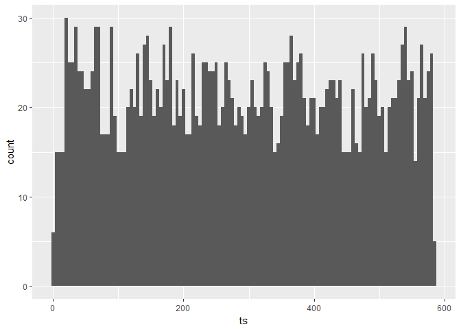
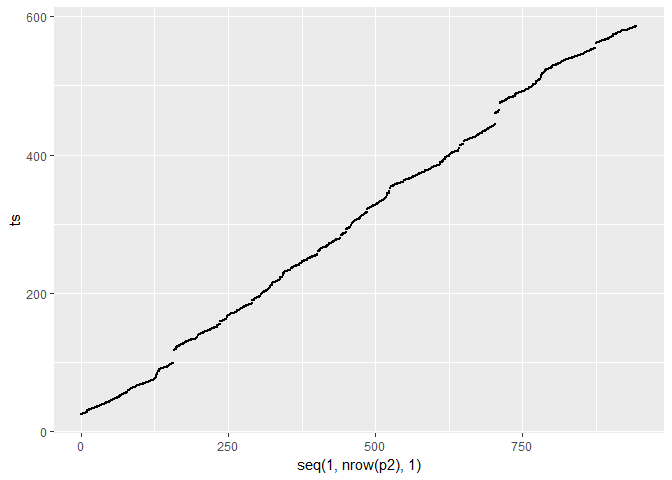
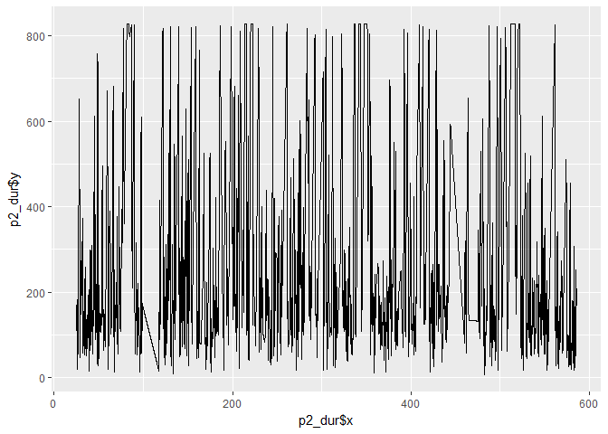

    library(DBI)

    ## Warning: package 'DBI' was built under R version 3.4.3

    library(ggplot2)

    ## Warning: package 'ggplot2' was built under R version 3.4.2

    library(jsonlite)

    ## Warning: package 'jsonlite' was built under R version 3.4.1

    library(sqldf)

    ## Warning: package 'sqldf' was built under R version 3.4.3

    ## Loading required package: gsubfn

    ## Warning: package 'gsubfn' was built under R version 3.4.3

    ## Loading required package: proto

    ## Warning: package 'proto' was built under R version 3.4.3

    ## Loading required package: RSQLite

    ## Warning: package 'RSQLite' was built under R version 3.4.3

    library(zoo)

    ## 
    ## Attaching package: 'zoo'

    ## The following objects are masked from 'package:base':
    ## 
    ##     as.Date, as.Date.numeric

    library(forecast)

    ## Warning: package 'forecast' was built under R version 3.4.4

    library(robustbase)

    ## Warning: package 'robustbase' was built under R version 3.4.4

Locating and exploring data base file
=====================================

    db <- dbConnect(SQLite(), dbname="task.db")
    alltables = dbListTables(db)
    alltables

    ## [1] "docker"     "ds"         "exec"       "io"         "open"      
    ## [6] "openma"     "tcpaccept"  "tcpconnect" "tcplife"

Locating "exec" table
=====================

    p1<-dbGetQuery( db,'select * from exec') 
    head(p1)

    ##      ts    exe   pid  ppid            path docker depth
    ## 1 0.690     sh 28531  1158         /bin/sh   <NA>    -1
    ## 2 0.696 lpstat 28532 28531 /usr/bin/lpstat   <NA>    -1
    ## 3 0.701    sed 28533 28531        /bin/sed   <NA>    -1
    ## 4 1.704     sh 28534  1158         /bin/sh   <NA>    -1
    ## 5 1.711    sed 28536 28534             sed   <NA>    -1
    ## 6 1.712 lpstat 28535 28534          lpstat   <NA>    -1
    ##                  rates
    ## 1 {"1": 1.0, "5": 0.2}
    ## 2 {"1": 2.0, "5": 0.4}
    ## 3 {"1": 3.0, "5": 0.6}
    ## 4 {"1": 1.0, "5": 0.8}
    ## 5 {"1": 2.0, "5": 1.0}
    ## 6 {"1": 3.0, "5": 1.2}

Function to seperate json string column "rates" in data set
===========================================================

    seperate<-function(z){
      new<-data.frame(X1=numeric(),X5=numeric())
      for(i in seq(1,nrow(z))){
        x<-data.frame(fromJSON(z$rates[i]))
        new<-rbind(new,x)
      }
      colnames(new)<-c("rate1s","rate2s")
      newdataframe<-cbind(p1,new)
      return(newdataframe)
    }
    updated_p1<-seperate(p1)
    head(updated_p1)

    ##      ts    exe   pid  ppid            path docker depth
    ## 1 0.690     sh 28531  1158         /bin/sh   <NA>    -1
    ## 2 0.696 lpstat 28532 28531 /usr/bin/lpstat   <NA>    -1
    ## 3 0.701    sed 28533 28531        /bin/sed   <NA>    -1
    ## 4 1.704     sh 28534  1158         /bin/sh   <NA>    -1
    ## 5 1.711    sed 28536 28534             sed   <NA>    -1
    ## 6 1.712 lpstat 28535 28534          lpstat   <NA>    -1
    ##                  rates rate1s rate2s
    ## 1 {"1": 1.0, "5": 0.2}      1    0.2
    ## 2 {"1": 2.0, "5": 0.4}      2    0.4
    ## 3 {"1": 3.0, "5": 0.6}      3    0.6
    ## 4 {"1": 1.0, "5": 0.8}      1    0.8
    ## 5 {"1": 2.0, "5": 1.0}      2    1.0
    ## 6 {"1": 3.0, "5": 1.2}      3    1.2

Making time-series chart and histograms of "exec" table
=======================================================

    histo_ts<-ggplot(updated_p1,aes(x=updated_p1$ts))+geom_histogram(stat="bin",binwidth = 5)+labs(x=c("ts"))
    ts<-ggplot(updated_p1,aes(x=seq(1,nrow(updated_p1),1),y=updated_p1$ts))+geom_point(size=0.01)+labs(y=c("ts"))
    histo_depth<-ggplot(p1,aes(x=p1$depth))+geom_histogram()+labs(x=c("depth"))+scale_y_continuous(breaks = seq(0,2000,50))+scale_x_continuous(breaks = seq(-2,6))
    depth<-ggplot(p1,aes(x=p1$ts,y=p1$depth))+geom_point(size=0.01)+labs(x=c("ts"),y=c("depth"))
    histo_rate1s<-ggplot(updated_p1,aes(x=updated_p1$rate1s))+geom_histogram(stat="bin",binwidth = .5)+labs(x=c("rate1s"))+scale_x_continuous(breaks = seq(0,20,1))
    rate1s<-ggplot(updated_p1,aes(y=updated_p1$rate1s,x=updated_p1$ts))+geom_point(size=0.01)+scale_y_continuous(breaks = seq(1,20,1))+scale_x_continuous(breaks = seq(0,600,50))+labs(x=c("ts"),y=c("rate1s"))
    histo_rate2s<-ggplot(updated_p1,aes(x=updated_p1$rate2s))+geom_histogram(stat="bin",binwidth = .10)+labs(x=c("rate2s"))+scale_x_continuous(breaks = seq(0,20,1))
    rate2s<-ggplot(updated_p1,aes(y=updated_p1$rate2s,x=updated_p1$ts))+geom_point(size=0.01)+scale_y_continuous(breaks = seq(0,7,1))+scale_x_continuous(breaks = seq(0,600,50))+labs(x=c("ts"),y=c("rate2s"))
    histo_ts

    ts

    depth

    histo_depth

    ## `stat_bin()` using `bins = 30`. Pick better value with `binwidth`.

    histo_rate1s

    rate1s

    histo_rate2s

    rate2s

Exploring "tcplife" table
=========================

    p2<-dbGetQuery( db,'select * from tcplife') 
    head(p2)

    ##         ts   pid lport rport  rx tx    dur
    ## 1 25.14706 28668 60290    80  30  0  93.65
    ## 2 25.53621 28669 47054    80 166  0 192.11
    ## 3 26.03953 28673 53762    80   0  0  81.72
    ## 4 26.20140 28673 50248    80   0  0  25.16
    ## 5 26.32941 28673 57968   443   0  0  17.78
    ## 6 26.63580 28679 47062    80 109  0 107.94
    ##                         histotimes                 histosizes
    ## 1  [[0, 0, 1, 0, 0], 93.65, 93.65]  [[0, 0, 1, 0, 0], 30, 30]
    ## 2 [[1, 0, 0, 0, 1], 93.65, 192.11] [[1, 0, 0, 0, 1], 30, 166]
    ## 3 [[2, 0, 0, 0, 1], 81.72, 192.11]  [[2, 0, 0, 0, 1], 0, 166]
    ## 4 [[1, 1, 1, 0, 1], 25.16, 192.11]  [[3, 0, 0, 0, 1], 0, 166]
    ## 5 [[2, 1, 1, 0, 1], 17.78, 192.11]  [[4, 0, 0, 0, 1], 0, 166]
    ## 6 [[2, 1, 2, 0, 1], 17.78, 192.11]  [[4, 0, 0, 1, 1], 0, 166]
    ##                                                                 histoports
    ## 1 [["22", "80", "443", "other"], {"443": 0, "80": 1, "other": 0, "22": 0}]
    ## 2 [["22", "80", "443", "other"], {"443": 0, "80": 2, "other": 0, "22": 0}]
    ## 3 [["22", "80", "443", "other"], {"443": 0, "80": 3, "other": 0, "22": 0}]
    ## 4 [["22", "80", "443", "other"], {"443": 0, "80": 4, "other": 0, "22": 0}]
    ## 5 [["22", "80", "443", "other"], {"443": 1, "80": 4, "other": 0, "22": 0}]
    ## 6 [["22", "80", "443", "other"], {"443": 1, "80": 5, "other": 0, "22": 0}]
    ##                                                                     docker
    ## 1 /docker/6aebd9a7d81f55435baff1afbcc16b11362669d035cdd435199b354ab1924041
    ## 2 /docker/6aebd9a7d81f55435baff1afbcc16b11362669d035cdd435199b354ab1924041
    ## 3 /docker/6aebd9a7d81f55435baff1afbcc16b11362669d035cdd435199b354ab1924041
    ## 4 /docker/6aebd9a7d81f55435baff1afbcc16b11362669d035cdd435199b354ab1924041
    ## 5 /docker/6aebd9a7d81f55435baff1afbcc16b11362669d035cdd435199b354ab1924041
    ## 6 /docker/6aebd9a7d81f55435baff1afbcc16b11362669d035cdd435199b354ab1924041
    ##   prediction predquality
    ## 1  -11.36298           1
    ## 2  -14.62913           1
    ## 3  -10.45235           1
    ## 4  -10.41434           1
    ## 5  -23.81738           0
    ## 6  -11.66737           1

Making charts for the "tcplife" table
=====================================

    histo_ts2<-ggplot(p2,aes(x=p2$ts))+geom_histogram(stat="bin",binwidth = 5)+labs(x=c("ts"))+scale_x_continuous(breaks=seq(0,600,50))
    ts2<-ggplot(p2,aes(x=seq(1,nrow(p2),1),y=p2$ts))+geom_point(size=0.01)+labs(y=c("ts"))
    histo_tx<-ggplot(p2,aes(x=p2$tx))+geom_histogram()+labs(x=c("tx"))
    tx<-ggplot(p2,aes(y=p2$tx,x=p2$ts))+geom_point(size=0.01)+scale_x_continuous(breaks = seq(0,600,50))+labs(x=c("ts"),y=c("tx"))
    histo_rx<-ggplot(p2,aes(x=p2$rx))+geom_histogram(stat="bin",binwidth = 5)+labs(x=c("rx"))+scale_x_continuous(breaks = seq(0,600,50))
    rx<-ggplot(p2,aes(y=p2$rx,x=p2$ts))+geom_point(size=0.01)+scale_x_continuous(breaks = seq(0,600,50))+labs(x=c("ts"),y=c("rx"))
    histo_dur<-ggplot(p2,aes(x=p2$dur))+geom_histogram(stat="bin",binwidth = 50)+labs(x=c("dur"))+scale_x_continuous(breaks = seq(0,7000,200))
    dur<-ggplot(p2,aes(y=p2$dur,x=p2$ts))+geom_point(size=0.01)+scale_x_continuous(breaks = seq(0,600,50))+scale_y_continuous(breaks = seq(0,7000,200))+labs(x=c("ts"),y=c("dur"))
    ggplot(p2,aes(y=p2$dur,x=p2$ts))+geom_line(size=0.01)+scale_x_continuous(breaks = seq(0,600,50))+scale_y_continuous(breaks = seq(0,7000,200))+labs(x=c("ts"),y=c("dur"))

    histo_lport<-ggplot(p2,aes(x=p2$lport))+geom_histogram(stat="bin",binwidth = 50)+labs(x=c("lport"))+scale_x_continuous(breaks = seq(0,70000,1000))
    p2$lport<-as.numeric(p2$lport)
    p2$rport<-as.numeric(p2$rport)
    lport<-ggplot(p2,aes(y=p2$lport,x=p2$ts))+geom_point(size=0.01)+scale_x_continuous(breaks = seq(0,600,50))+labs(x=c("ts"),y=c("lport"))
    ggplot(p2,aes(y=p2$lport,x=p2$ts))+geom_line(size=0.01)+scale_x_continuous(breaks = seq(0,600,50))+labs(x=c("ts"),y=c("lport"))

    histo_rport<-ggplot(p2,aes(x=p2$rport))+geom_histogram(stat="bin",binwidth = 10)+labs(x=c("rport"))+scale_x_continuous(breaks = seq(0,500,10))
    rport<-ggplot(p2,aes(y=p2$rport,x=p2$ts))+geom_point(size=0.01)+scale_x_continuous(breaks = seq(0,600,50))+labs(x=c("ts"),y=c("rport"))
    histo_ts2

    ts2

    histo_tx

    ## `stat_bin()` using `bins = 30`. Pick better value with `binwidth`.

    tx

    histo_rx

    rx

    histo_dur

    dur

    histo_lport

    lport

    histo_rport

    rport

Descriptive statistics of "dur column"
======================================

    summary(p2$dur)

    ##    Min. 1st Qu.  Median    Mean 3rd Qu.    Max. 
    ##    5.04   85.51  144.65  261.22  226.80 6454.02

    IQR(p2$dur)

    ## [1] 141.285

    range(p2$dur)

    ## [1]    5.04 6454.02

-   Unimodal distribution
-   Duration column is Rightly skewed since mean&gt;median, median is
    closer to 1sr quartile ,it can also be infered from histogram.
-   Presence ofoutliers which readily skews the distribution
-   Due to the presence of high value anaomalies in duration, mean
    location is even greater then the 75 percentile location.

<!-- -->

    boxplot(p2$dur)

Using robust measure of skewness to detect outliers
===================================================

    medcouple<-mc(p2$dur)
    lower_limit<-85.51-(1.5*(2.71828^(-3*mc(p2$dur)))*IQR(p2$dur))
    upper_limit<-226.80+(1.5*(2.71828^(4*mc(p2$dur)))*IQR(p2$dur))
    lower_limit

    ## [1] -11.54815

    upper_limit

    ## [1] 827.136

    outliers<-p2[p2$dur<lower_limit|p2$dur>upper_limit,]
    outliers

    ##            ts   pid lport rport  rx tx     dur
    ## 126  77.58492 28924 50332    80  32  0 1072.59
    ## 128  81.50789 28939 59886    80   0  0 3002.86
    ## 129  83.38067 28949 54534    80   0  0 1521.07
    ## 131  86.95723 28959 54080    80  61  0 1552.26
    ## 133  89.90351 28970 51830    80  37  0  851.22
    ## 162 121.79607 29089 59954    80   0  0 3006.16
    ## 179 130.41568 29131 55692    80  90  0 1066.95
    ## 199 139.89857 29170 46316    80   0  0 3003.30
    ## 232 153.79532 29254 54430    80   1  0 2352.90
    ## 237 158.83555 29268 52816    80   0  0 3001.89
    ## 246 162.77855 29299 52644   443  22  0  894.25
    ## 290 186.00773 29409 54938    80  88  0 1149.17
    ## 306 198.52800 29456 37900    80  30  0 2769.53
    ## 321 208.55454 29502 37806    80   9  0 1182.28
    ## 325 213.79112 29520 46198    80   0  0 1085.64
    ## 326 215.39830 29520 46200    80  14  0 1293.99
    ## 338 220.27886 29551 51490    80   0  0 1398.49
    ## 339 222.53331 29551 51492    80   8  0 2110.28
    ## 344 229.34746 29580 52430    80   0  0 3003.39
    ## 375 245.41354 29662 52486    80   0  0 1408.20
    ## 403 261.00458 29722 55626    80   0  0 3004.28
    ## 442 283.75677 29831 48918    80  52  0 1383.81
    ## 464 304.62983 29916 40418    80  54  0  944.24
    ## 477 312.27861 29940 44434   443 199  0  859.04
    ## 488 322.68601 29990 58484    80  39  0  848.72
    ## 515 336.37866 30052 56666    80   0  0 1251.78
    ## 516 337.60132 30052 56668    80   5  0 1014.98
    ## 520 341.88516 30070 44010    80   0  0 3001.72
    ## 521 343.92312 30085 46592    80   4  0 1688.73
    ## 524 347.87770 30094 60678    80   0  0 3005.00
    ## 525 351.16382 30107 60680    80   0  0 3003.39
    ## 527 354.08712 30117 41576    80   4  0 1539.08
    ## 619 396.36843 30320 53820   443  30  0 1168.53
    ## 642 409.81192 30383 34474    80 339  0 2166.20
    ## 644 413.82894 30394 33818    80   0  0 3002.46
    ## 651 420.38329 30420 42124    80   0  0 3003.89
    ## 673 428.53803 30465 37250    80   6  0 1428.42
    ## 738 488.11848 30694 36532    80   4  0 2940.31
    ## 761 496.81166 30743 59508    80  38  0 1030.92
    ## 774 506.24662 30775 40118    80   0  0 3002.33
    ## 781 512.12805 30798 45046    80   0  0 2640.32
    ## 782 515.35588 30798 45048    80   0  0 3004.65
    ## 783 517.05320 30820 34490    80   4  0 1345.39
    ## 788 520.67778 30833 39636    80  54  0 1037.08
    ## 789 522.58966 30833 39638    80 114  0 1426.58
    ## 875 561.61440 31008 48024    80 100  0 6454.02
    ##                                histotimes                     histosizes
    ## 126    [[98, 20, 3, 4, 1], 9.58, 1072.59]    [[73, 49, 2, 1, 1], 0, 427]
    ## 128    [[121, 6, 0, 0, 1], 9.58, 3002.86]    [[75, 49, 2, 1, 1], 0, 427]
    ## 129    [[121, 6, 1, 0, 1], 9.58, 3002.86]    [[76, 49, 2, 1, 1], 0, 427]
    ## 131    [[121, 7, 2, 0, 1], 9.58, 3002.86]    [[78, 49, 2, 1, 1], 0, 427]
    ## 133    [[122, 8, 2, 0, 1], 9.58, 3002.86]    [[79, 50, 2, 1, 1], 0, 427]
    ## 162    [[149, 9, 2, 0, 2], 9.58, 3006.16]    [[98, 57, 5, 1, 1], 0, 427]
    ## 179   [[165, 10, 2, 0, 2], 9.58, 3006.16]   [[106, 65, 6, 1, 1], 0, 427]
    ## 199   [[184, 10, 2, 0, 3], 7.17, 3006.16]   [[118, 70, 9, 1, 1], 0, 427]
    ## 232   [[215, 11, 2, 1, 3], 7.17, 3006.16]   [[138, 82, 9, 2, 1], 0, 427]
    ## 237   [[219, 11, 2, 1, 4], 7.17, 3006.16]   [[142, 83, 9, 2, 1], 0, 427]
    ## 246   [[227, 12, 2, 1, 4], 5.04, 3006.16]  [[147, 86, 10, 2, 1], 0, 427]
    ## 290   [[270, 13, 2, 1, 4], 5.04, 3006.16] [[173, 100, 14, 2, 1], 0, 427]
    ## 306   [[285, 13, 2, 1, 5], 5.04, 3006.16] [[183, 106, 14, 2, 1], 0, 427]
    ## 321   [[297, 16, 2, 1, 5], 5.04, 3006.16] [[193, 110, 15, 2, 1], 0, 427]
    ## 325   [[300, 17, 2, 1, 5], 5.04, 3006.16] [[196, 111, 15, 2, 1], 0, 427]
    ## 326   [[300, 17, 3, 1, 5], 5.04, 3006.16] [[197, 111, 15, 2, 1], 0, 427]
    ## 338   [[311, 17, 4, 1, 5], 5.04, 3006.16] [[202, 117, 15, 3, 1], 0, 427]
    ## 339   [[311, 17, 4, 2, 5], 5.04, 3006.16] [[203, 117, 15, 3, 1], 0, 427]
    ## 344   [[315, 17, 4, 2, 6], 5.04, 3006.16] [[204, 121, 15, 3, 1], 0, 427]
    ## 375   [[345, 17, 5, 2, 6], 5.04, 3006.16] [[220, 133, 18, 3, 1], 0, 427]
    ## 403   [[372, 17, 5, 2, 7], 5.04, 3006.16] [[236, 144, 19, 3, 1], 0, 427]
    ## 442   [[409, 18, 6, 2, 7], 5.04, 3006.16] [[259, 160, 19, 3, 1], 0, 427]
    ## 464   [[427, 22, 6, 2, 7], 5.04, 3006.16] [[272, 169, 19, 3, 1], 0, 427]
    ## 477   [[439, 23, 6, 2, 7], 5.04, 3006.16] [[280, 173, 20, 3, 1], 0, 427]
    ## 488   [[449, 24, 6, 2, 7], 5.04, 3006.16] [[288, 176, 20, 3, 1], 0, 427]
    ## 515   [[475, 24, 7, 2, 7], 5.04, 3006.16] [[304, 186, 21, 3, 1], 0, 427]
    ## 516   [[475, 25, 7, 2, 7], 5.04, 3006.16] [[305, 186, 21, 3, 1], 0, 427]
    ## 520   [[478, 25, 7, 2, 8], 5.04, 3006.16] [[306, 189, 21, 3, 1], 0, 427]
    ## 521   [[478, 25, 8, 2, 8], 5.04, 3006.16] [[307, 189, 21, 3, 1], 0, 427]
    ## 524   [[480, 25, 8, 2, 9], 5.04, 3006.16] [[309, 190, 21, 3, 1], 0, 427]
    ## 525  [[480, 25, 8, 2, 10], 5.04, 3006.16] [[310, 190, 21, 3, 1], 0, 427]
    ## 527  [[481, 25, 9, 2, 10], 5.04, 3006.16] [[312, 190, 21, 3, 1], 0, 427]
    ## 619  [[570, 28, 9, 2, 10], 5.04, 3006.16] [[364, 225, 26, 3, 1], 0, 427]
    ## 642  [[592, 28, 9, 3, 10], 5.04, 3006.16] [[381, 230, 26, 4, 1], 0, 427]
    ## 644  [[593, 28, 9, 3, 11], 5.04, 3006.16] [[382, 231, 26, 4, 1], 0, 427]
    ## 651  [[599, 28, 9, 3, 12], 5.04, 3006.16] [[383, 236, 27, 4, 1], 0, 427]
    ## 673 [[620, 28, 10, 3, 12], 5.04, 3006.16] [[403, 238, 27, 4, 1], 0, 427]
    ## 738 [[682, 30, 10, 3, 13], 5.04, 3006.16] [[443, 258, 32, 4, 1], 0, 427]
    ## 761 [[704, 31, 10, 3, 13], 5.04, 3006.16] [[458, 263, 35, 4, 1], 0, 427]
    ## 774 [[715, 32, 10, 3, 14], 5.04, 3006.16] [[464, 269, 35, 5, 1], 0, 427]
    ## 781 [[721, 32, 10, 3, 15], 5.04, 3006.16] [[469, 271, 35, 5, 1], 0, 427]
    ## 782 [[721, 32, 10, 3, 16], 5.04, 3006.16] [[470, 271, 35, 5, 1], 0, 427]
    ## 783 [[721, 32, 11, 3, 16], 5.04, 3006.16] [[471, 271, 35, 5, 1], 0, 427]
    ## 788 [[724, 34, 11, 3, 16], 5.04, 3006.16]  [[558, 220, 6, 3, 1], 0, 540]
    ## 789 [[724, 34, 12, 3, 16], 5.04, 3006.16]  [[558, 221, 6, 3, 1], 0, 540]
    ## 875  [[845, 13, 16, 0, 1], 5.04, 6454.02]  [[621, 242, 7, 4, 1], 0, 540]
    ##                                                                      histoports
    ## 126 [["22", "80", "443", "other"], {"443": 20, "80": 106, "other": 0, "22": 0}]
    ## 128 [["22", "80", "443", "other"], {"443": 20, "80": 108, "other": 0, "22": 0}]
    ## 129 [["22", "80", "443", "other"], {"443": 20, "80": 109, "other": 0, "22": 0}]
    ## 131 [["22", "80", "443", "other"], {"443": 20, "80": 111, "other": 0, "22": 0}]
    ## 133 [["22", "80", "443", "other"], {"443": 20, "80": 113, "other": 0, "22": 0}]
    ## 162 [["22", "80", "443", "other"], {"443": 25, "80": 137, "other": 0, "22": 0}]
    ## 179 [["22", "80", "443", "other"], {"443": 25, "80": 154, "other": 0, "22": 0}]
    ## 199 [["22", "80", "443", "other"], {"443": 27, "80": 172, "other": 0, "22": 0}]
    ## 232 [["22", "80", "443", "other"], {"443": 32, "80": 200, "other": 0, "22": 0}]
    ## 237 [["22", "80", "443", "other"], {"443": 32, "80": 205, "other": 0, "22": 0}]
    ## 246 [["22", "80", "443", "other"], {"443": 34, "80": 212, "other": 0, "22": 0}]
    ## 290 [["22", "80", "443", "other"], {"443": 36, "80": 254, "other": 0, "22": 0}]
    ## 306 [["22", "80", "443", "other"], {"443": 38, "80": 268, "other": 0, "22": 0}]
    ## 321 [["22", "80", "443", "other"], {"443": 40, "80": 281, "other": 0, "22": 0}]
    ## 325 [["22", "80", "443", "other"], {"443": 40, "80": 285, "other": 0, "22": 0}]
    ## 326 [["22", "80", "443", "other"], {"443": 40, "80": 286, "other": 0, "22": 0}]
    ## 338 [["22", "80", "443", "other"], {"443": 42, "80": 296, "other": 0, "22": 0}]
    ## 339 [["22", "80", "443", "other"], {"443": 42, "80": 297, "other": 0, "22": 0}]
    ## 344 [["22", "80", "443", "other"], {"443": 42, "80": 302, "other": 0, "22": 0}]
    ## 375 [["22", "80", "443", "other"], {"443": 43, "80": 332, "other": 0, "22": 0}]
    ## 403 [["22", "80", "443", "other"], {"443": 47, "80": 356, "other": 0, "22": 0}]
    ## 442 [["22", "80", "443", "other"], {"443": 51, "80": 391, "other": 0, "22": 0}]
    ## 464 [["22", "80", "443", "other"], {"443": 53, "80": 411, "other": 0, "22": 0}]
    ## 477 [["22", "80", "443", "other"], {"443": 55, "80": 422, "other": 0, "22": 0}]
    ## 488 [["22", "80", "443", "other"], {"443": 55, "80": 433, "other": 0, "22": 0}]
    ## 515 [["22", "80", "443", "other"], {"443": 55, "80": 460, "other": 0, "22": 0}]
    ## 516 [["22", "80", "443", "other"], {"443": 55, "80": 461, "other": 0, "22": 0}]
    ## 520 [["22", "80", "443", "other"], {"443": 55, "80": 465, "other": 0, "22": 0}]
    ## 521 [["22", "80", "443", "other"], {"443": 55, "80": 466, "other": 0, "22": 0}]
    ## 524 [["22", "80", "443", "other"], {"443": 55, "80": 469, "other": 0, "22": 0}]
    ## 525 [["22", "80", "443", "other"], {"443": 55, "80": 470, "other": 0, "22": 0}]
    ## 527 [["22", "80", "443", "other"], {"443": 55, "80": 472, "other": 0, "22": 0}]
    ## 619 [["22", "80", "443", "other"], {"443": 66, "80": 553, "other": 0, "22": 0}]
    ## 642 [["22", "80", "443", "other"], {"443": 68, "80": 574, "other": 0, "22": 0}]
    ## 644 [["22", "80", "443", "other"], {"443": 68, "80": 576, "other": 0, "22": 0}]
    ## 651 [["22", "80", "443", "other"], {"443": 68, "80": 583, "other": 0, "22": 0}]
    ## 673 [["22", "80", "443", "other"], {"443": 73, "80": 600, "other": 0, "22": 0}]
    ## 738 [["22", "80", "443", "other"], {"443": 80, "80": 658, "other": 0, "22": 0}]
    ## 761 [["22", "80", "443", "other"], {"443": 82, "80": 679, "other": 0, "22": 0}]
    ## 774 [["22", "80", "443", "other"], {"443": 83, "80": 691, "other": 0, "22": 0}]
    ## 781 [["22", "80", "443", "other"], {"443": 84, "80": 697, "other": 0, "22": 0}]
    ## 782 [["22", "80", "443", "other"], {"443": 84, "80": 698, "other": 0, "22": 0}]
    ## 783 [["22", "80", "443", "other"], {"443": 84, "80": 699, "other": 0, "22": 0}]
    ## 788 [["22", "80", "443", "other"], {"443": 84, "80": 704, "other": 0, "22": 0}]
    ## 789 [["22", "80", "443", "other"], {"443": 84, "80": 705, "other": 0, "22": 0}]
    ## 875 [["22", "80", "443", "other"], {"443": 99, "80": 776, "other": 0, "22": 0}]
    ##                                                                       docker
    ## 126 /docker/6aebd9a7d81f55435baff1afbcc16b11362669d035cdd435199b354ab1924041
    ## 128 /docker/6aebd9a7d81f55435baff1afbcc16b11362669d035cdd435199b354ab1924041
    ## 129 /docker/6aebd9a7d81f55435baff1afbcc16b11362669d035cdd435199b354ab1924041
    ## 131 /docker/6aebd9a7d81f55435baff1afbcc16b11362669d035cdd435199b354ab1924041
    ## 133 /docker/6aebd9a7d81f55435baff1afbcc16b11362669d035cdd435199b354ab1924041
    ## 162 /docker/6aebd9a7d81f55435baff1afbcc16b11362669d035cdd435199b354ab1924041
    ## 179 /docker/6aebd9a7d81f55435baff1afbcc16b11362669d035cdd435199b354ab1924041
    ## 199 /docker/6aebd9a7d81f55435baff1afbcc16b11362669d035cdd435199b354ab1924041
    ## 232 /docker/6aebd9a7d81f55435baff1afbcc16b11362669d035cdd435199b354ab1924041
    ## 237 /docker/6aebd9a7d81f55435baff1afbcc16b11362669d035cdd435199b354ab1924041
    ## 246 /docker/6aebd9a7d81f55435baff1afbcc16b11362669d035cdd435199b354ab1924041
    ## 290 /docker/6aebd9a7d81f55435baff1afbcc16b11362669d035cdd435199b354ab1924041
    ## 306 /docker/6aebd9a7d81f55435baff1afbcc16b11362669d035cdd435199b354ab1924041
    ## 321 /docker/6aebd9a7d81f55435baff1afbcc16b11362669d035cdd435199b354ab1924041
    ## 325 /docker/6aebd9a7d81f55435baff1afbcc16b11362669d035cdd435199b354ab1924041
    ## 326 /docker/6aebd9a7d81f55435baff1afbcc16b11362669d035cdd435199b354ab1924041
    ## 338 /docker/6aebd9a7d81f55435baff1afbcc16b11362669d035cdd435199b354ab1924041
    ## 339 /docker/6aebd9a7d81f55435baff1afbcc16b11362669d035cdd435199b354ab1924041
    ## 344 /docker/6aebd9a7d81f55435baff1afbcc16b11362669d035cdd435199b354ab1924041
    ## 375 /docker/6aebd9a7d81f55435baff1afbcc16b11362669d035cdd435199b354ab1924041
    ## 403 /docker/6aebd9a7d81f55435baff1afbcc16b11362669d035cdd435199b354ab1924041
    ## 442 /docker/6aebd9a7d81f55435baff1afbcc16b11362669d035cdd435199b354ab1924041
    ## 464 /docker/6aebd9a7d81f55435baff1afbcc16b11362669d035cdd435199b354ab1924041
    ## 477 /docker/6aebd9a7d81f55435baff1afbcc16b11362669d035cdd435199b354ab1924041
    ## 488 /docker/6aebd9a7d81f55435baff1afbcc16b11362669d035cdd435199b354ab1924041
    ## 515 /docker/6aebd9a7d81f55435baff1afbcc16b11362669d035cdd435199b354ab1924041
    ## 516 /docker/6aebd9a7d81f55435baff1afbcc16b11362669d035cdd435199b354ab1924041
    ## 520 /docker/6aebd9a7d81f55435baff1afbcc16b11362669d035cdd435199b354ab1924041
    ## 521 /docker/6aebd9a7d81f55435baff1afbcc16b11362669d035cdd435199b354ab1924041
    ## 524 /docker/6aebd9a7d81f55435baff1afbcc16b11362669d035cdd435199b354ab1924041
    ## 525 /docker/6aebd9a7d81f55435baff1afbcc16b11362669d035cdd435199b354ab1924041
    ## 527 /docker/6aebd9a7d81f55435baff1afbcc16b11362669d035cdd435199b354ab1924041
    ## 619 /docker/6aebd9a7d81f55435baff1afbcc16b11362669d035cdd435199b354ab1924041
    ## 642 /docker/6aebd9a7d81f55435baff1afbcc16b11362669d035cdd435199b354ab1924041
    ## 644 /docker/6aebd9a7d81f55435baff1afbcc16b11362669d035cdd435199b354ab1924041
    ## 651 /docker/6aebd9a7d81f55435baff1afbcc16b11362669d035cdd435199b354ab1924041
    ## 673 /docker/6aebd9a7d81f55435baff1afbcc16b11362669d035cdd435199b354ab1924041
    ## 738 /docker/6aebd9a7d81f55435baff1afbcc16b11362669d035cdd435199b354ab1924041
    ## 761 /docker/6aebd9a7d81f55435baff1afbcc16b11362669d035cdd435199b354ab1924041
    ## 774 /docker/6aebd9a7d81f55435baff1afbcc16b11362669d035cdd435199b354ab1924041
    ## 781 /docker/6aebd9a7d81f55435baff1afbcc16b11362669d035cdd435199b354ab1924041
    ## 782 /docker/6aebd9a7d81f55435baff1afbcc16b11362669d035cdd435199b354ab1924041
    ## 783 /docker/6aebd9a7d81f55435baff1afbcc16b11362669d035cdd435199b354ab1924041
    ## 788 /docker/6aebd9a7d81f55435baff1afbcc16b11362669d035cdd435199b354ab1924041
    ## 789 /docker/6aebd9a7d81f55435baff1afbcc16b11362669d035cdd435199b354ab1924041
    ## 875 /docker/6aebd9a7d81f55435baff1afbcc16b11362669d035cdd435199b354ab1924041
    ##     prediction predquality
    ## 126  -20.65428           0
    ## 128 -123.12514           0
    ## 129  -35.11589           0
    ## 131  -36.49185           0
    ## 133  -15.98615           1
    ## 162 -123.40331           0
    ## 179  -22.09086           0
    ## 199 -121.83579           0
    ## 232  -76.28348           0
    ## 237 -121.98732           0
    ## 246  -19.51497           0
    ## 290  -24.05165           0
    ## 306 -104.48825           0
    ## 321  -24.16592           0
    ## 325  -20.99059           0
    ## 326  -26.76080           0
    ## 338  -30.42450           0
    ## 339  -61.88948           0
    ## 344 -122.07256           0
    ## 375  -30.83663           0
    ## 403 -122.50344           0
    ## 442  -29.89131           0
    ## 464  -18.18627           0
    ## 477  -15.19760           1
    ## 488  -16.82484           0
    ## 515  -26.31103           0
    ## 516  -19.97627           0
    ## 520 -121.77927           0
    ## 521  -41.33910           0
    ## 524 -123.46527           0
    ## 525 -123.33690           0
    ## 527  -35.54918           0
    ## 619  -24.19865           0
    ## 642  -89.64112           0
    ## 644 -123.17306           0
    ## 651 -122.07358           0
    ## 673  -32.01815           0
    ## 738 -117.70223           0
    ## 761  -20.84574           0
    ## 774 -122.14018           0
    ## 781  -94.71383           0
    ## 782 -121.97158           0
    ## 783  -29.72441           0
    ## 788  -20.36180           0
    ## 789  -33.54724           0
    ## 875 -569.24519           0

Outlier Treatment
=================

    p2[p2$dur>upper_limit,]$dur<-c(upper_limit)

-Capping the values to extreme

Viewing Time series plot of "dur" variable
==========================================

    ggplot(p2,aes(y=p2$dur,x=p2$ts))+geom_line(size=0.01)+scale_x_continuous(breaks = seq(0,600,50))+scale_y_continuous(breaks = seq(0,7000,200))+labs(x=c("ts"),y=c("dur"))

-Plot is some what stationary time series (means appear constant also
there is no trend) -Problem is to create time series data with regular
time series interval - No seasonal pattern observed

Creating time series with .1 time interval
==========================================

    p2_dur<-approx(p2$ts, p2$dur, xout = seq(25,585.6,.1), method = "linear")
    p2_dur<-as.data.frame(p2_dur)
    head(p2_dur)

    ##      x        y
    ## 1 25.0       NA
    ## 2 25.1       NA
    ## 3 25.2 107.0433
    ## 4 25.3 132.3446
    ## 5 25.4 157.6459
    ## 6 25.5 182.9472

    p2_dur<-p2_dur[-c(1,2),]
    head(p2_dur)

    ##      x        y
    ## 3 25.2 107.0433
    ## 4 25.3 132.3446
    ## 5 25.4 157.6459
    ## 6 25.5 182.9472
    ## 7 25.6 178.1203
    ## 8 25.7 156.1878

Time series and decomposed plot of p2\_dur
==========================================

    ggplot(p2_dur,aes(y=p2_dur$y,x=p2_dur$x))+geom_line(size=0.01)

    series<-zoo(p2_dur$y,order.by = p2_dur$x)
    decomp = stl(series,s.window = T)
    plot(decomp)

-   Plot is created by taking approximate value of the "dur" variable at
    a interval of .1 second
-   No observed trend

Understanding ACF and PACF plot
===============================

    plot(acf(p2_dur$y))

    plot(pacf(p2_dur$y))

-   Since ACF plot decays slowly so it is mostly AR series by observing
    -Also PACF cuts out after 1 lag so it is a AR1 process just by
    observing

Applying Auto Arima model and predicting next 25 observations
=============================================================

    mod<-auto.arima(series,seasonal = F)
    mod

    ## Series: series 
    ## ARIMA(2,0,2) with non-zero mean 
    ## 
    ## Coefficients:
    ##          ar1      ar2     ma1     ma2      mean
    ##       1.3365  -0.3805  0.2832  0.0475  291.5223
    ## s.e.  0.0441   0.0425  0.0453  0.0290   15.7205
    ## 
    ## sigma^2 estimated as 1520:  log likelihood=-28484.44
    ## AIC=56980.89   AICc=56980.9   BIC=57020.68

-   So Final model is combination of AR(2) and MA(2) model
-   Coefficients are specified
-   As observed the data points were stationary so d=0 was taken i.e. no
    need of differncing.

Forecasting next 25 values
==========================

    predict<-forecast(mod,h=25)
    predict

    ##        Point Forecast     Lo 80    Hi 80      Lo 95    Hi 95
    ## 585.70      103.75936  53.80053 153.7182   27.35393 180.1648
    ## 585.80       81.74548 -13.35573 176.8467  -63.69927 227.1902
    ## 585.90       82.58961 -49.39555 214.5748 -119.26428 284.4435
    ## 586.00       92.09410 -68.52261 252.7108 -153.54796 337.7362
    ## 586.10      104.47609 -78.43307 287.3852 -175.25932 384.2115
    ## 586.20      117.40873 -83.09521 317.9127 -189.23559 424.0530
    ## 586.30      129.98246 -84.61218 344.5771 -198.21172 458.1766
    ## 586.40      141.86697 -84.15728 367.8912 -203.80729 487.5412
    ## 586.50      152.96687 -82.42605 388.3598 -207.03553 512.9693
    ## 586.60      163.28035 -79.85627 406.4170 -208.56502 535.1257
    ## 586.70      172.84128 -76.73827 422.4208 -208.85770 554.5403
    ## 586.80      181.69564 -73.27263 436.6639 -208.24468 571.6359
    ## 586.90      189.89196 -69.60204 449.3860 -206.96986 586.7538
    ## 587.00      197.47765 -65.82997 460.7853 -205.21661 600.1719
    ## 587.10      204.49757 -62.03226 471.0274 -203.12462 612.1198
    ## 587.20      210.99368 -58.26463 480.2520 -200.80137 622.7887
    ## 587.30      217.00494 -54.56792 488.5778 -198.32991 632.3398
    ## 587.40      222.56751 -50.97169 496.1067 -195.77459 640.9096
    ## 587.50      227.71486 -47.49690 502.9266 -193.18521 648.6149
    ## 587.60      232.47797 -44.15793 509.1139 -190.60012 655.5561
    ## 587.70      236.88553 -40.96402 514.7351 -188.04869 661.8197
    ## 587.80      240.96407 -37.92051 519.8486 -185.55308 667.4812
    ## 587.90      244.73815 -35.02965 524.5060 -183.12977 672.6061
    ## 588.00      248.23051 -32.29136 528.7524 -180.79067 677.2517
    ## 588.10      251.46217 -29.70379 532.6281 -178.54406 681.4684

    plot(predict)

